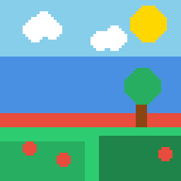

# Aseprite MCP Server

A Model Context Protocol (MCP) server that exposes Aseprite's pixel art and animation capabilities to AI assistants, enabling you to create and edit sprites using natural language.



*Example scene created using pixel-mcp: 64x64 indexed sprite with custom 16-color palette, demonstrating drawing primitives (rectangles, circles) and palette management.*

## Features

- **Canvas & Layer Management:** RGB, Grayscale, and Indexed color modes with multi-layer support and layer deletion
- **Drawing Primitives:** Pixels, lines, rectangles, circles, polylines, flood fill with batch operations and palette-aware drawing
- **Selection Tools:** Rectangle, ellipse, select all, copy, cut, paste, move selections with multiple blend modes (replace/add/subtract/intersect)
- **Professional Pixel Art Tools:**
  - **Reference Analysis:** Extract palettes, brightness maps, edge detection, and composition guides from images
  - **Color Quantization:** Reduce images to 2-256 colors using median_cut, k-means, or octree algorithms with optional Floyd-Steinberg dithering
  - **Automatic Shading:** Apply geometry-based shading with 3 styles (cell/smooth/soft), 8 light directions, and adjustable intensity
  - **Dithering:** 16 patterns including Bayer matrices (2x2, 4x4, 8x8), Floyd-Steinberg, checkerboard, and textures (grass, water, stone, cloud, brick, dots, diagonal, cross, noise, lines)
  - **Palette Management:** Set custom palettes (1-256 colors), sort by hue/luminance, analyze color harmonies (complementary/triadic/analogous), and extract from reference images
  - **Shading Tools:** Apply palette-constrained shading with smooth, hard, or pillow styles and 8 light directions
  - **Antialiasing:** Detect jagged diagonal edges and suggest intermediate colors for smoother curves (manual or auto-apply)
  - **Transform Operations:** Flip, rotate, scale, crop, resize canvas, apply outlines, and downsample for pixel art conversion
  - **Palette-Aware Drawing:** All drawing tools support snapping to nearest palette color using LAB color space
- **Animation Tools:** Frame durations, tags, frame duplication/deletion, linked cels
- **Inspection Tools:** Read pixel data with pagination for verification and analysis
- **Export Formats:** PNG, GIF, JPG, BMP, and spritesheet export (horizontal/vertical/grid layouts)
- **Cross-platform:** Windows, macOS, Linux
- **MCP Integration:** Works with Claude Desktop and other MCP clients

## Requirements

- Go 1.23+
- Aseprite 1.3.0+ (1.3.10+ recommended)

## Quick Start

### 1. Install

```bash
# Clone the repository
git clone https://github.com/willibrandon/pixel-mcp.git
cd pixel-mcp

# Build the server
make build
```

### 2. Configure

Create `~/.config/pixel-mcp/config.json`:

```json
{
  "aseprite_path": "/path/to/aseprite",
  "temp_dir": "/tmp/pixel-mcp",
  "timeout": 30,
  "log_level": "info",
  "log_file": "",
  "enable_timing": false
}
```

**Configuration options:**
- `aseprite_path` (required): Absolute path to Aseprite executable. No automatic discovery or environment variables.
- `temp_dir` (optional): Directory for temporary files. Defaults to `/tmp/pixel-mcp`.
- `timeout` (optional): Command timeout in seconds. Defaults to 30.
- `log_level` (optional): Logging verbosity (`debug`, `info`, `warn`, `error`). Defaults to `info`.
- `log_file` (optional): Path to log file for persistent logging. If empty, logs only to stderr.
- `enable_timing` (optional): Enable request tracking and operation timing. Defaults to `false`.

### 3. Run

```bash
# Run the server (stdio transport)
./bin/pixel-mcp

# Check health
./bin/pixel-mcp --health

# Enable debug logging
./bin/pixel-mcp --debug
```

## Usage with Claude Desktop

Add to your Claude Desktop config:

```json
{
  "mcpServers": {
    "aseprite": {
      "command": "/absolute/path/to/pixel-mcp"
    }
  }
}
```

Then use natural language to create sprites:
- "Create a 64x64 sprite and draw a red circle in the center"
- "Add a new layer called 'Background' and fill it with blue"
- "Export the sprite as a PNG"

## Available Tools

### Canvas & Layer Management
| Tool | Description |
|------|-------------|
| `create_canvas` | Create new sprite with specified dimensions and color mode |
| `add_layer` | Add a new layer to the sprite |
| `delete_layer` | Delete a layer from the sprite (cannot delete last layer) |
| `get_sprite_info` | Get sprite metadata (size, layers, frames) |

### Drawing & Painting
| Tool | Description |
|------|-------------|
| `draw_pixels` | Draw individual pixels (supports batch operations, optional palette snapping) |
| `draw_line` | Draw a line between two points (optional palette snapping) |
| `draw_contour` | Draw a polyline or polygon by connecting multiple points (optional palette snapping) |
| `draw_rectangle` | Draw a rectangle (filled or outline, optional palette snapping) |
| `draw_circle` | Draw a circle/ellipse (filled or outline, optional palette snapping) |
| `fill_area` | Flood fill from a point (paint bucket, optional palette snapping) |

### Selection & Clipboard
| Tool | Description |
|------|-------------|
| `select_rectangle` | Create a rectangular selection with mode (replace/add/subtract/intersect) |
| `select_ellipse` | Create an elliptical selection with mode (replace/add/subtract/intersect) |
| `select_all` | Select the entire canvas |
| `deselect` | Clear the current selection |
| `move_selection` | Move selection bounds by offset (does not move pixels) |
| `cut_selection` | Cut selected pixels to clipboard |
| `copy_selection` | Copy selected pixels to clipboard |
| `paste_clipboard` | Paste clipboard content at specified position |

**Note**: Selection and clipboard operations persist across MCP tool calls using sprite custom properties (`sprite.data`) and a hidden clipboard layer. This allows you to create a selection in one tool call, then copy/cut/paste in subsequent calls. Selection bounds are automatically saved and restored, and clipboard content is stored in a hidden `__mcp_clipboard__` layer.

### Professional Pixel Art
| Tool | Description |
|------|-------------|
| `analyze_reference` | Extract palette, brightness map, edges, and composition from reference images |
| `draw_with_dither` | Fill region with dithering patterns (15 patterns: Bayer, checkerboard, grass, water, stone, cloud, brick, etc.) |
| `downsample_image` | Downsample high-res images to pixel art dimensions using box filter |
| `get_palette` | Retrieve current sprite palette as array of hex colors with size |
| `set_palette` | Set sprite's color palette to specified colors (supports 1-256 colors) |
| `set_palette_color` | Set a specific palette index to a color (0-255) |
| `add_palette_color` | Add a new color to the palette (max 256 colors) |
| `sort_palette` | Sort palette by hue, saturation, brightness, or luminance (ascending/descending) |
| `apply_shading` | Apply palette-constrained shading based on light direction (smooth, hard, or pillow styles) |
| `analyze_palette_harmonies` | Analyze palette for complementary, triadic, analogous relationships and color temperature |
| `suggest_antialiasing` | Detect jagged diagonal edges and suggest intermediate colors for smooth curves (with optional auto-apply) |

### Transform & Filter
| Tool | Description |
|------|-------------|
| `flip_sprite` | Flip sprite, layer, or cel horizontally or vertically |
| `rotate_sprite` | Rotate sprite, layer, or cel by 90, 180, or 270 degrees |
| `scale_sprite` | Scale sprite with algorithm selection (nearest, bilinear, rotsprite) |
| `crop_sprite` | Crop sprite to rectangular region |
| `resize_canvas` | Resize canvas without scaling content (with anchor positioning) |
| `apply_outline` | Apply outline effect to layer with configurable color and thickness |

### Animation
| Tool | Description |
|------|-------------|
| `add_frame` | Add a new animation frame |
| `delete_frame` | Delete a frame from the sprite (cannot delete last frame) |
| `set_frame_duration` | Set the duration of an animation frame in milliseconds |
| `create_tag` | Create an animation tag with playback direction |
| `delete_tag` | Delete an animation tag by name |
| `duplicate_frame` | Duplicate an existing frame with all cels |
| `link_cel` | Create a linked cel that shares image data |

### Inspection & Export
| Tool | Description |
|------|-------------|
| `get_pixels` | Read pixel data from a rectangular region (paginated, for verification) |
| `export_sprite` | Export sprite to PNG/GIF/JPG/BMP |
| `export_spritesheet` | Export animation frames as spritesheet (horizontal/vertical/rows/columns/packed layout, optional JSON metadata) |
| `import_image` | Import external image file as a layer in the sprite |
| `save_as` | Save sprite to a new .aseprite file path |

## Examples

See [examples/](examples/) for a complete working example client that demonstrates all features including canvas creation, animation, dithering, palette management, shading, and antialiasing.

## Development

### Using Make

```bash
# Build (development - fast, no version info)
make build

# Build release (with version and timestamp)
make release

# Run unit tests
make test

# Run unit tests (no cache)
make test-nocache

# Run integration tests (requires configured Aseprite)
make test-integration

# Run integration tests (no cache)
make test-integration-nocache

# Run benchmarks
make bench

# Run linters
make lint

# Generate coverage report
make test-coverage

# Clean build artifacts
make clean
```

### Using Go CLI

```bash
# Build (development)
go build -o bin/pixel-mcp ./cmd/pixel-mcp

# Build release (with version info)
go build -ldflags "-X main.Version=$(git describe --tags --always --dirty) -X main.BuildTime=$(date -u '+%Y-%m-%d_%H:%M:%S')" -o bin/pixel-mcp ./cmd/pixel-mcp

# Run unit tests
go test -v -race -cover ./...

# Run unit tests (no cache)
go test -v -race -cover -count=1 ./...

# Run integration tests
go test -tags=integration -v ./...

# Run integration tests (no cache)
go test -tags=integration -v -count=1 ./...

# Run benchmarks
go test -tags=integration -bench=. -benchmem ./pkg/aseprite ./pkg/tools

# Run linters
go vet ./...
go fmt ./...

# Generate coverage report
go test -v -race -coverprofile=coverage.txt -covermode=atomic ./...
go tool cover -html=coverage.txt -o coverage.html
```

## Performance

All operations complete in under 100ms on typical hardware, with complete workflows finishing in 280-840ms. See [docs/BENCHMARKS.md](docs/BENCHMARKS.md) for detailed benchmark results.

## License

[MIT](LICENSE)